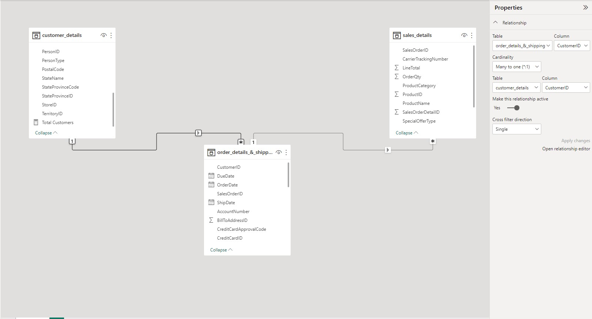
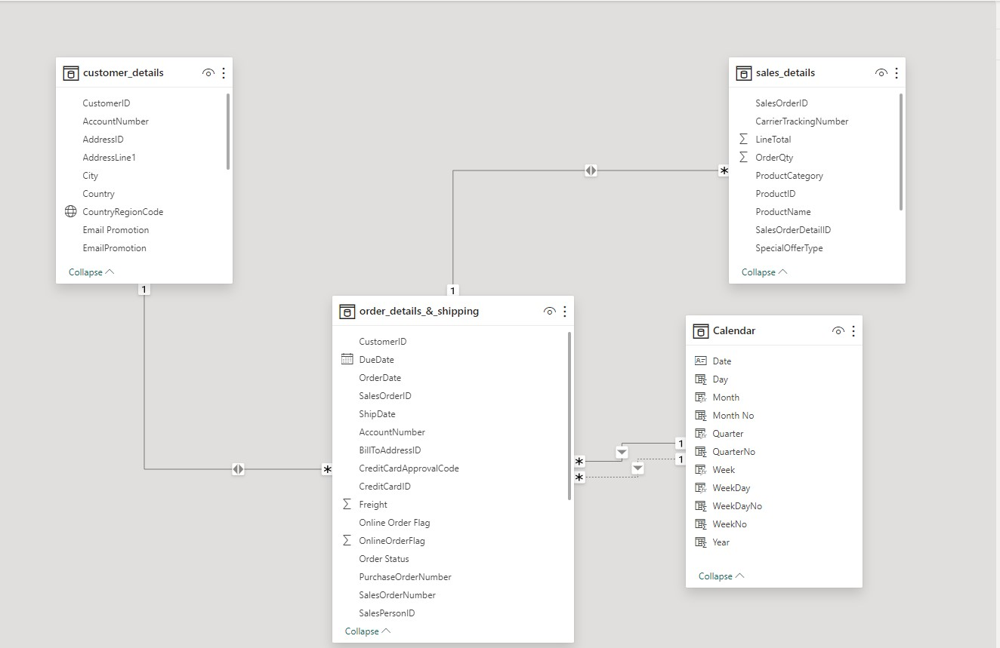
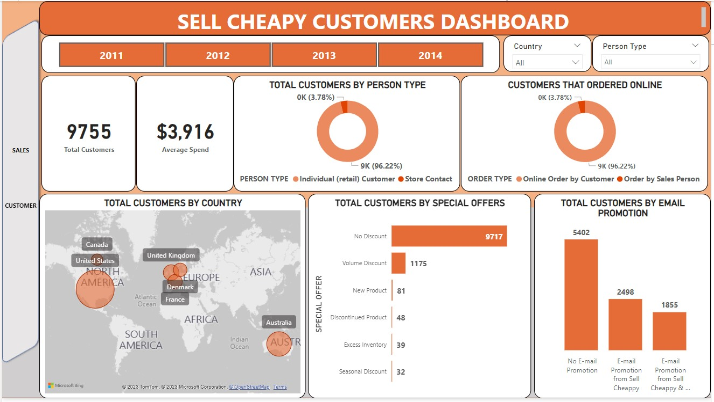
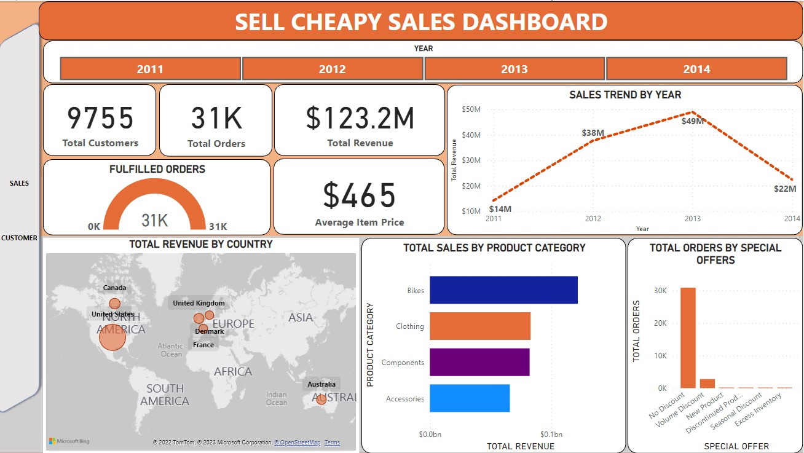

# Sell Cheapy Analysis
___

___
## INTRODUCTION
___
I decided to take up the analytics challenge from Olanrewaju Oyinbooke and as well as improve my own skills and gain more experience as I work on this project.
### PROBLEM STATEMENT
SellCheapy Retail is a chain of department stores that sells a wide range of products, including bikes and different components. Despite having a large customer base, the company has been struggling to increase sales in recent years. The management team is looking to use data analysis to understand customer spending patterns and make changes to their sales and marketing strategies to improve performance.
 
The company collected data on customer demographics, purchasing history, and other relevant information over the course of a year. The data includes information on the products purchased, the price paid, and the date of purchase, etc.

I’ll be using the provided dataset to understand customer spending patterns and make changes to their sales and marketing strategies to improve performance.
*	___What do customers spend on the most?___
*	___What encourages them to spend on this product?___
*	___Where are our customers from?___
*	___What is our order fulfilment rate?___
*	___How much do our customers spend when shopping & how do we increase spending?___
___
## DATA SOURCING
___
The dataset for this analysis is from the Adventure works database provided by Olanrewaju Oyinbooke at; [Sell Cheapy Dataset](https://techcommunity.microsoft.com/t5/educator-developer-blog/data-analysis-challenge-analyze-customer-spending-pattern/ba-p/3719590?WT.mc_id=academic-86947-ooyinbooke).

The database contains multiple tables, but for this project I am interested in the tables with data on customer demographics and sales/order details. I carefully studied the database schema and data dictionary to pick out this tables and also used multiple joins to extracted the right information; all this was done in **MS SQL SERVER**
___
## SKILLS DEMONSTRATED
___
For this project, I used the following skills or tools;
*	___SQL: I used complex JOINS to query the database in SQL SERVER to gather the necessary data for this project.___ 
*	___DAX: After loading the data into Power BI I used Measures and DAX to aggregate the necessary data I needed___
*	___Power BI customization: I used the buttons feature in Power BI to create a more interactive dashboard.___
___
## DATA TRANSFORMATION
___
After importing the data to Power BI, I did some transformation to add additional columns (Conditional columns). I added this column to the **CUSTOMER_DETAILS & ORDER_DETAILS_&_SHIPPING** table, some of the steps include;
*	Adding conditional column **“Person Type”** to the **CUSTOMER_DETAILS** table to assign descriptive values to the column instead of the default abbreviations for more context ie **SC = ‘Store Contact’**, **IN = ‘Individual (retail) Customer’** etc..
*	Adding conditional column **“Order Status”** to the **ORDER_DETAILS_&_SHIPPING** table to assign descriptive values to the column instead of the default numeric values ie __1 = ‘In Process’, 2 = ‘Approved’__ etc.
*	Adding conditional column **“Country”** to the **CUSTOMER_DETAILS** table to assign Country names to the column instead of the default ISO codes.
___
## DATA MODELLING
___
I have 3 tables; 
* ___CUSTOMER_DETAILS___
* ___SALES_DETAILS___
* ___ORDER_DETAILS_&_SHIPPING___  
Loading the dataset into Power Bi automatically creates an automatic model, but I will be making some adjustments to the auto model created by Power BI;
*	I changed the ___‘Cross-filter direction’ to ‘Both’___ to allow a more dynamic filtering.
*	___CUSTOMER_DETAILS & ORDER_DETAILS_&_SHIPPING___ have a Many to **One(*:1)** relationship
*	___SALES_DETAILS & ORDER_DETAILS_&_SHIPPING___ have a Many to **One(*:1)** relationship
The relationship formed in the model is a star schema as seen below;

|AUTO-MODEL|ADJUSTED-MODEL|
|----------|--------------|
|||
___
## ANALYSIS & VISUALIZATION
___
This report contains 2 pages/dashboard; 

|CUSTOMER|SALES|
|----------|--------------|
|||
___
## RECOMMENDATION & CONCLUSION
___

Special OFFErS HAVE NO EFFECT ON THE Accessories category so they should be more special offers for other categories to boost their sales

Data collection process should be reviewed to get proper customer demography

