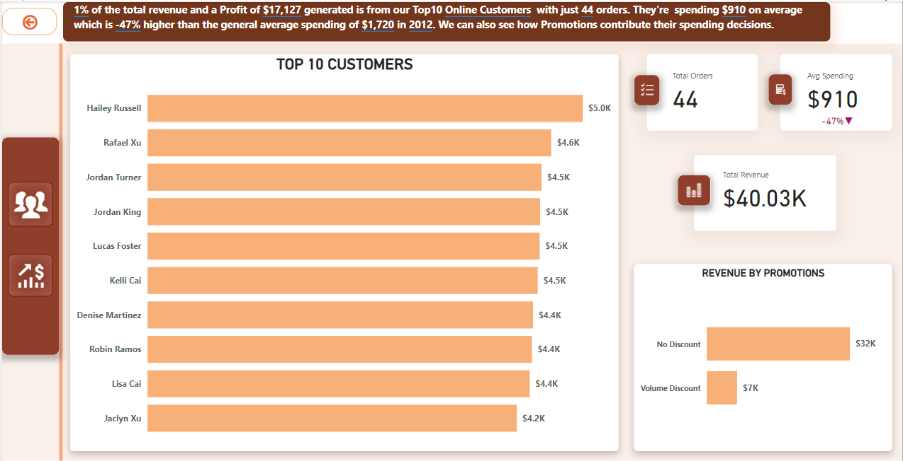
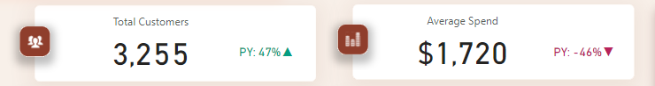

# Sell Cheapy Analysis
## by Kola Ademola
___

___
## INTRODUCTION
___
I decided to take up the analytics challenge from Olanrewaju Oyinbooke and as well as improve my own skills and gain more experience as I work on this project.
### PROBLEM STATEMENT
SellCheapy Retail is a chain of department stores that sells a wide range of products, including bikes and different components. Despite having a large customer base, the company has been struggling to increase sales in recent years. The management team is looking to use data analysis to understand customer spending patterns and make changes to their sales and marketing strategies to improve performance.
 
The company collected data on customer demographics, purchasing history, and other relevant information over the course of a year. The data includes information on the products purchased, the price paid, and the date of purchase, etc.

I’ll be using the provided dataset to understand customer spending patterns and make changes to their sales and marketing strategies to improve performance.
*	___What do customers spend on the most & does Special offers/discount drives this?___
*	___What has sales been like over the years?___
*	___Where are our customers from?___
*	___What is our order fulfilment rate?___
*	___How much do our customers spend when shopping & how do we increase spending?___
___
## DATA SOURCING
___
The dataset for this analysis is from the Adventure works database provided by Olanrewaju Oyinbooke at; [Sell Cheapy Dataset](https://techcommunity.microsoft.com/t5/educator-developer-blog/data-analysis-challenge-analyze-customer-spending-pattern/ba-p/3719590?WT.mc_id=academic-86947-ooyinbooke).

The database contains multiple tables, but for this project I am interested in the tables with data on customer demographics and sales/order details. I carefully studied the database schema and data dictionary to pick out this tables and also used multiple joins to extracted the right information; all this was done in **MS SQL SERVER**
___
## SKILLS DEMONSTRATED
___
For this project, I used the following skills or tools;
*	___SQL: I used complex JOINS to query the database in SQL SERVER to gather the necessary data for this project.___   

#### DATA IMPORTATION/LOADING
I connected to an SQL SERVER database for this project and imported the data to Power BI.  
    

## DATA TRANSFORMATION
___
After importing the data to Power BI, I did alot of transformation to remove columnss that were not neccesary for my analysis.  
I also created 2 new tables to have all my sales and customers on same table, this is because we have 2 types of customers (*Resellers & Online customers*) which led to 2 different sales tables for the respective customers. So I had to use some advanced transformation in Power Query to get all sales and customers on the same table each.

___
## DATA MODELLING
___
I have 12 tables; 
* __DimCustomer__ 
* __DimGeography__  
* __DimProduct__  
* __DimProductSubcategory__  
* __DimProductCategory__  
* __DimPromotion__  
* __DimReseller__  
* __DimSalesReason__  
* __DimSalesTerritory__  
* __FactInternetSales__  
* __FactInternetSalesReason__  
* __FactResellerSales__
  
*Loading the dataset into Power Bi automatically creates an automatic model, but I will be making alot of adjustments to the auto model created by Power BI;*
*	I avoided setting ___‘Cross-filter direction’ to ‘Both’___ as this is not very good for performance generally, instead I used *DAX* for __cross-filtering__ to allow a more dynamic filtering.
*	I added a *Calendar* table to my model.
*	*	___DAX: After loading the data into Power BI I used Measures and DAX to aggregate the necessary data I needed___
*	I used alot of *DAX* measure for; analysis, calculations, adding calculated columns etc...
I was able to create a **Snowflake Schema** model;

|AUTO-MODEL|ADJUSTED-MODEL|
|----------|--------------|
|||  
*	___Power BI customization: I used the buttons feature in Power BI to create a more interactive dashboard.___
___
___
## ANALYSIS & VISUALIZATION
___
This report contains 2 pages/dashboard; 

|CUSTOMER|SALES|
|----------|--------------|
|||
|This gives an overview and general information on Customers like; **Total Customers**, **Average amount spent**, **Customers location** etc...|This gives an overview and general information on Sales like; **Total Orders**, **Average Item Price**, **Sales Trend over the years** etc...  
### LINK TO DASHBOARD :::: [SELL CHEAPY DASHBOARD](https://app.powerbi.com/view?r=eyJrIjoiNzhkOTY3MWItYWRiZS00ZjU0LTkzMjMtZjQxYTliNjhmMjczIiwidCI6ImQyMzQyMjIxLWJiM2ItNGQ1ZS04NWRmLTkyYzFlOTg0YTNlZCJ9)
___
#### Note: All snapshots are from the year 2011, but the trnd is generally the same with slight difference. To get the full analysis pls explore the [Interactive Dashboard](https://app.powerbi.com/view?r=eyJrIjoiNzhkOTY3MWItYWRiZS00ZjU0LTkzMjMtZjQxYTliNjhmMjczIiwidCI6ImQyMzQyMjIxLWJiM2ItNGQ1ZS04NWRmLTkyYzFlOTg0YTNlZCJ9) 
___ 
#### KPI's  
  
### ___What do customers spend on the most & does Special offers/discount drives this?___  
  
>  Products in the **BIKES** category generates the most revenue & profit generally  
   
* but Drilling further to see if anything is driving this sales for the **Bikes**, we can see that **Special Offers/Promotions** does not drive sales for it because most items still **sold without discount**

> Even from our top customers, it is still the same. **Discount** does not drive sales.

___
### ___What has sales been like over the years?___
#### Sales Trend Overview from 2011 - 2013
* We can see a steady increase from 2011 - 2013, with *2013* as the best year with over **$49M** in sales & **$8M** in profit.  
#### 2011 Sales Trend

#### 2012 Sales Trend

#### 2013 Sales Trend
  
___

### 	___Where are our customers from?___
  
Customers are spread out across 6 diffrent countries but, Most of the customer base is from **USA** with;
* Almost **10,000** customers
* **$60M** in Revenue and..
* Over **59,000+** orders. 
___
###	___What is our order fulfilment rate?___

* There's a 100% **FULFILLMENT** rate as we can see that all **121,000+** orders were fulfilled/delivered to customers
___
###	___How much do our customers spend when shopping & how do we increase spending?___

* The **Average Order Value** generally shows that customers spend around **$748** on average.
  > We can increase spending by creating complimentary product offers, by bundling **Bikes*8 & **Components/Accessories** together in a single sale.
___
## RECOMMENDATION & CONCLUSION
___
#### Here are my recommendations;

* Special sales should be carried out more often in the form of Discount or any other form of Special Offers to boost sales, we can see that most sales were made even without discount or any form of special offers, so there is a chance to increase sales when more special offers are intoduced.  

* The marketing team should think of a good marketing campaign to promote sales in other countries. Majority of sales and customers are in the USA, so the marketing team should look into carrying out marketing campaigns and targeted ads at other country to boost sales and gain more customers as well.  
  
* The Bikes category is our best selling and we should definetly keep pushing them, while looking at how other product categories can be boosted to make more sales as well.

