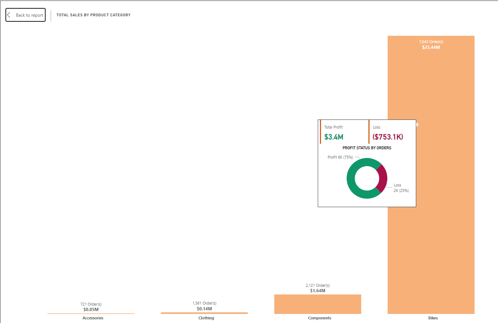
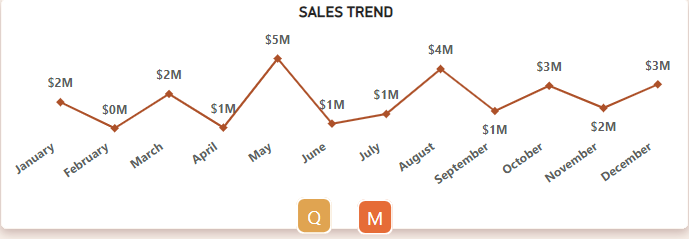
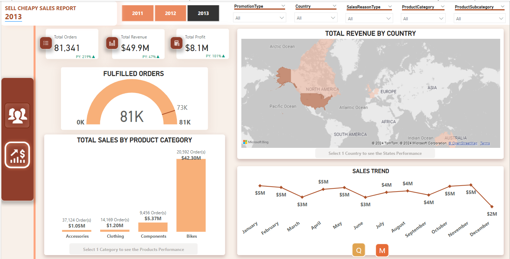
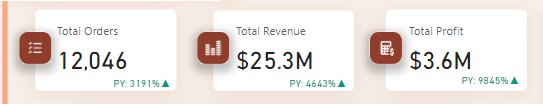

# Sell Cheapy Analysis
## by Kola Ademola
___

___
## INTRODUCTION
___
I decided to take up the analytics challenge from Olanrewaju Oyinbooke and as well as improve my own skills and gain more experience as I work on this project.
### PROBLEM STATEMENT
SellCheapy Retail is a chain of department stores that sells a wide range of products, including bikes and different components. Despite having a large customer base, the company has been struggling to increase sales in recent years. The management team is looking to use data analysis to understand customer spending patterns and make changes to their sales and marketing strategies to improve performance.
 
The company collected data on customer demographics, purchasing history, and other relevant information over the course of a year. The data includes information on the products purchased, the price paid, and the date of purchase, etc.

I’ll be using the provided dataset to understand customer spending patterns and make changes to their sales and marketing strategies to improve performance.
*	___What do customers spend on the most & What drives this?___
*	___What has sales been like over the years?___
*	___Where are our customers from?___
*	___What is our order fulfilment rate?___
*	___How much do our customers spend when shopping & how do we increase spending?___
___
## DATA SOURCING
___
The dataset for this analysis is from the Adventure works database provided by Olanrewaju Oyinbooke at; [Sell Cheapy Dataset](https://techcommunity.microsoft.com/t5/educator-developer-blog/data-analysis-challenge-analyze-customer-spending-pattern/ba-p/3719590?WT.mc_id=academic-86947-ooyinbooke).

The database contains multiple tables, but for this project I am interested in the tables with data on customer demographics and sales/order details. I carefully studied the database schema and data dictionary to pick out this tables and also used multiple joins to extracted the right information; all this was done in **MS SQL SERVER**
___
## SKILLS DEMONSTRATED
___
For this project, I used the following skills or tools;
*	___SQL: I used complex JOINS to query the database in SQL SERVER to gather the necessary data for this project.___   
**CUSTOMER TABLE QUERY**

**SALES TABLE QUERY**

**ORDER & SHIPPING TABLE QUERY**
  

#### DATA IMPORTATION/LOADING
I connected to an SQL SERVER database for this project and imported the data to Power BI.  
    

## DATA TRANSFORMATION
___
After importing the data to Power BI, I did some transformation to add additional columns (Conditional columns). I added this column to the **CUSTOMER_DETAILS & ORDER_DETAILS_&_SHIPPING** table, some of the steps include;
*	Adding conditional column **“Person Type”** to the **CUSTOMER_DETAILS** table to assign descriptive values to the column instead of the default abbreviations for more context ie **SC = ‘Store Contact’**, **IN = ‘Individual (retail) Customer’** etc..
*	Adding conditional column **“Order Status”** to the **ORDER_DETAILS_&_SHIPPING** table to assign descriptive values to the column instead of the default numeric values ie __1 = ‘In Process’, 2 = ‘Approved’__ etc.
*	Adding conditional column **“Country”** to the **CUSTOMER_DETAILS** table to assign Country names to the column instead of the default ISO codes.
___
## DATA MODELLING
___
I have 12 tables; 
* __DimCustomer__ 
* __DimGeography__  
* __DimProduct__  
* __DimProductSubcategory__  
* __DimProductCategory__  
* __DimPromotion__  
* __DimReseller__  
* __DimSalesReason__  
* __DimSalesTerritory__  
* __FactInternetSales__  
* __FactInternetSalesReason__  
* __FactResellerSales__  
Loading the dataset into Power Bi automatically creates an automatic model, but I will be making alot of adjustments to the auto model created by Power BI;
*	I avoided setting ___‘Cross-filter direction’ to ‘Both’___ as this is not very good for performance generally, instead I used *DAX* for __cross-filtering__ to allow a more dynamic filtering.
*	I added a *Calendar* table to my model.
*	*	___DAX: After loading the data into Power BI I used Measures and DAX to aggregate the necessary data I needed___
*	I used alot of *DAX* measure for; analysis, calculations, adding calculated columns etc...
I was able to create a **Snowflake Schema** model;

|AUTO-MODEL|ADJUSTED-MODEL|
|----------|--------------|
|||  
*	___Power BI customization: I used the buttons feature in Power BI to create a more interactive dashboard.___
___
___
## ANALYSIS & VISUALIZATION
___
This report contains 2 pages/dashboard; 

|CUSTOMER|SALES|
|----------|--------------|
|||
|This gives an overview and general information on Customers like; **Total Customers**, **Average amount spent**, **Customers location** etc...|This gives an overview and general information on Sales like; **Total Orders**, **Average Item Price**, **Sales Trend over the years** etc...|
### LINK TO DASHBOARD :::: [SELL CHEAPY DASHBOARD](https://app.powerbi.com/view?r=eyJrIjoiNzhkOTY3MWItYWRiZS00ZjU0LTkzMjMtZjQxYTliNjhmMjczIiwidCI6ImQyMzQyMjIxLWJiM2ItNGQ1ZS04NWRmLTkyYzFlOTg0YTNlZCJ9)
___

### ___What do customers spend on the most & What drives this?___

* Products in the **BIKES** category generate the most revenue & profit generally
*   
* and sales is not driven by **Special Offers/Promotions** because most items still **sold without discount**

___
### ___What has sales been like over the years?___
#### Sales Trend Overview from 2011 - 2014

* We can see a steady increase from 2011 - 2013 which is the best year with over **$49M** in sales, but since then sales started declining.
#### 2011 Sales Trend

#### 2012 Sales Trend

#### 2013 Sales Trend

#### KPI's

___

### 	___Where are our customers from?___
  
Customers are spread out across 6 diffrent countries but, Most of the customeer base is from **USA** with;
* Over **4400** customers
* **$46.8M** in Sales and..
* Over **7000+** orders. 
___
###	___What is our order fulfilment rate?___

* There's a 100% **FULFILLMENT** rate as we can see, all 31,000+ orders were fulfilled/delivered to customers
___
###	___How much do our customers spend when shopping & how do we increase spending?___

* The **Average Order Value** shows that customers spend **$3,916** on average.
___
## RECOMMENDATION & CONCLUSION
___
#### Here are my recommendations;

* Special sales should be carried out more often in the form of Discount or any other form of Special Offers to boost sales, we can see that most sales were made even with discount or any form of special offers, so there will be an increase in sales when more special offers are intoduced.  

* The marketing team should think of a good marketing campaign to promote sales in other countries. Mohority of sales and customers are in the USA, so the marketing team should look into carrying out marketing campaigns and targeted ads at other country to boost sales and gain more customers as well.  
  
* The data collection process should be reviewed because they are a lot of issues with the data quality. Customer demographic data were missing and this was a major limitation for this analysis and I suggest the data collection and integrity should be reviewed as well so we have enough data and get a better knowledge of sales and customers as weell.

